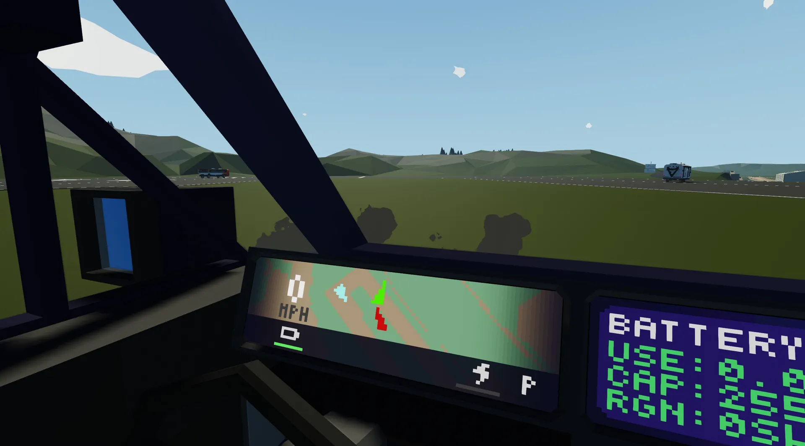

# SenConnect 2
[SentyTek Website](https://sentytek.github.io/software/senconnect)

## Connected Parties Made Easy
SenConnect simplifies the way you stay connected with other drivers. SenConnect can display the position of other SentyTek vehicles on the dashboard map, giving a social aspect to driving. You can see where your friends are, coordinate meetups, and even share your location for safety purposes. 

Whether you're cruising with friends or just want to see who's out there, SenConnect makes it easy to stay connected on the road. It's a simple way to add a little more fun and connection to your drives. It's even possible to have private parties and secure codes.

# The SenConnect 2 Standard
SenConnect 2 is a remarkably simple standard that allows rich car-2-car communications. It allows sending your position, heading, a color ID, and a name over the network to other vehicles.

Vehicle names occupy channels 7-25 on the Transmitter. With 2 ASCII characters per channel, this allows names up to 36 characters long. To not prevent flooding the display, the SenCar implementation of SenConnect 2 only shows the name when a vehicle pointer is clicked on.

## Definitions
- Transmitter - The radio that is set to always transmit mode, which transmits information about the vehicle.
- Scanner - The radio that is not set to transmit, which receives information from other vehicles.

## Transmitter Composite Channels
Numbers:
1. Group ID (Float, any range)
2. Transmitter Frequency (Int, 100..200)
3. X coordinate (Float, any range)
4. Y coordinate (Float, any range)
5. Heading (Float, 0..360)
6. Color ID (Int, 1..7)

7-25. Vehicle name (Ints, ASCII (30..39, 65..90), 2 chars/channel)

26-32. Inop.

## Current Limitations
- Colors can only be one of a few values set from an integer. These colors are the Bright colors from any of the selectable SenCar 6 theme colors. This means variable colors are currently not supported.